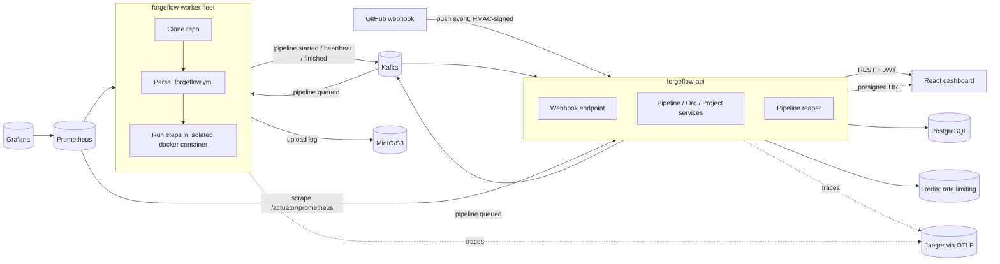

# ForgeFlow

**Distributed CI/CD & Job Orchestration Platform** — a portfolio-scale, but real, implementation
of the core ideas behind systems like GitHub Actions/CircleCI: a webhook-triggered pipeline
runs in an isolated Docker container on a horizontally-scalable worker fleet, coordinated over
Kafka, with real-time status, logs and artifacts surfaced in a React dashboard.

Built by **Khawla Boughattas** as a hands-on demonstration of distributed-systems, backend and
DevOps engineering: event-driven architecture, worker fault-tolerance, container isolation,
observability and infrastructure-as-code.

## Architecture



## Features

- **Webhook-triggered pipelines** — GitHub `push` webhooks, verified with HMAC-SHA256
  (constant-time comparison), idempotent on `github_delivery_id`.
- **Event-driven orchestration** — pipeline lifecycle (`QUEUED → RUNNING → SUCCEEDED/FAILED`,
  with `RETRY_SCHEDULED`/`CANCELLED`) is driven by Kafka events published only after the owning
  DB transaction commits (`@TransactionalEventListener(phase = AFTER_COMMIT)`).
- **Isolated build execution** — each pipeline step runs inside a dedicated, resource-limited
  Docker container (`--memory`, `--cpus`, non-root `--user 1000:1000`) with a hard timeout.
- **Distributed, fault-tolerant workers** — workers heartbeat while running; a scheduled reaper
  on the API detects stalled pipelines (missed heartbeats) and requeues them with exponential
  backoff, up to a retry limit, before marking them permanently failed.
- **Auth & RBAC** — JWT (HS256) authentication; organizations/projects with
  `OWNER`/`ADMIN`/`MEMBER` roles and a last-owner-protection invariant.
- **Artifact storage** — build logs uploaded to MinIO/S3-compatible storage; the dashboard
  downloads them via short-lived presigned URLs.
- **Rate limiting** — Redis fixed-window limiter on the auth endpoints; fails open if Redis is
  unreachable (documented trade-off, see Security below).
- **Observability** — Micrometer → OTLP → Jaeger tracing, Prometheus metrics (including custom
  business counters), and a provisioned Grafana dashboard.
- **React dashboard** — login/register, organizations, projects, repository connection (with a
  one-time webhook-secret reveal), pipeline history, a live-ish (polling) pipeline detail view
  with log tail and artifact download.
- **Kubernetes manifests** — Deployments/Services/HPAs for the whole stack via `kustomize`.

## Tech stack

| Layer           | Technology |
|-----------------|------------|
| Backend         | Java 21, Spring Boot 3.3.5 (Web, Security, Data JPA, Validation, Actuator) |
| Messaging       | Apache Kafka (KRaft mode) |
| Database        | PostgreSQL 16, Flyway migrations |
| Caching / rate limiting | Redis 7 |
| Object storage  | MinIO (S3-compatible), AWS SDK v2 |
| Auth            | JWT (jjwt), BCrypt |
| Observability   | Micrometer, OpenTelemetry (OTLP), Jaeger, Prometheus, Grafana |
| Frontend        | React 18, TypeScript, Vite, React Router |
| Testing         | JUnit 5, Testcontainers (Postgres/Kafka/Redis) |
| Infra           | Docker, Docker Compose, Kubernetes (kustomize), GitHub Actions |

## Getting started

Prerequisites: Docker + Docker Compose, JDK 21, Maven 3.9+ (`mvn` on your `PATH` — this build
intentionally does not ship a Maven wrapper; see **Notes on this build** below), Node.js 20+.

```bash
# 1. Infra: Postgres, Redis, Kafka, MinIO, Jaeger, Prometheus, Grafana
cp .env.example .env    # edit values, especially passwords and JWT_SECRET
set -a && source .env && set +a
docker compose up -d

# 2. Backend — from the repo root (forgeflow-api depends on forgeflow-common)
mvn -pl forgeflow-common,forgeflow-api,forgeflow-worker -am install -DskipTests
mvn -pl forgeflow-api spring-boot:run      # http://localhost:8080
mvn -pl forgeflow-worker spring-boot:run   # in a second terminal, http://localhost:8081

# 3. Frontend
cd frontend
cp .env.example .env
npm install
npm run dev                                 # http://localhost:5173
```

Register a user via the dashboard, create an organization and a project, then connect a GitHub
repository — the response shows the webhook secret **once**. Configure a GitHub webhook on that
repo for the `push` event, pointed at `http://<your-host>/api/v1/webhooks/github`, using that
secret. A push then flows: webhook → `pipeline.queued` → a worker picks it up, clones the repo,
reads `.forgeflow.yml`, and runs the steps in an isolated container.

### `.forgeflow.yml` reference

Place this at the root of a connected repository:

```yaml
image: node:20-alpine
steps:
  - name: install
    run: npm ci
  - name: test
    run: npm test
```

`image` is the Docker image each step runs in; `steps` is an ordered list of `{name, run}` shell
commands. The file is parsed with SnakeYAML's `SafeConstructor`, so it can never deserialize into
anything beyond plain maps/lists/scalars — arbitrary-object instantiation from untrusted,
repository-supplied YAML is not possible.

## Testing

```bash
mvn -pl forgeflow-common,forgeflow-api,forgeflow-worker -am test     # unit tests
mvn -pl forgeflow-api verify                                          # + Testcontainers integration tests (needs Docker)
```

`forgeflow-api` integration tests spin up real Postgres, Kafka and Redis containers via
Testcontainers. `forgeflow-worker`'s `DockerJobExecutorTest` includes cases that need network
access and a Docker daemon available to the test JVM; those are marked accordingly and can be
skipped in constrained CI environments.

## Security

**Implemented:**
- Passwords hashed with BCrypt; JWT (HS256) auth with configurable expiry.
- GitHub webhook signatures verified with HMAC-SHA256 using constant-time comparison
  (`MessageDigest.isEqual`); deliveries are idempotent on `github_delivery_id`.
- RBAC on organizations/projects with a last-owner-protection invariant.
- Build containers run as a non-root user with CPU/memory limits and an execution timeout.
- `.forgeflow.yml` parsed with a `SafeConstructor` to block YAML-deserialization attacks.
- Rate limiting on login/register endpoints.

**Known, stated gaps** (acceptable for a portfolio project, called out rather than hidden):
- Build containers currently have network and filesystem write access — necessary for `npm
  install`-style steps to work against the public internet, but it means a malicious step isn't
  fully sandboxed from the outside world. A production system would add an egress allowlist/proxy.
- Only public GitHub repositories are supported (no credential handling for private repos).
- Events are published via `@TransactionalEventListener(AFTER_COMMIT)`, not a transactional
  outbox table — there's a narrow window where a DB commit succeeds but the Kafka publish fails,
  which an outbox pattern would close.
- The Redis rate limiter **fails open**: if Redis is unreachable, requests are allowed rather
  than blocked, trading availability for strictness.
- The Kubernetes worker Deployment mounts the host's `/var/run/docker.sock`
  (docker-outside-of-docker) so it can run isolated build containers — this grants
  root-equivalent access to the node's Docker daemon and is a real container-escape vector in a
  genuinely multi-tenant cluster. A production system would replace this with sandboxed,
  per-job execution (e.g. Kubernetes Jobs under gVisor/Kata, or a remote build service).

## Architecture decisions

- **Kafka over a simple DB-polling queue** — lets the worker fleet scale horizontally and
  decouples pipeline admission from execution; `pipeline.*` topics each have a matching `.DLT`
  dead-letter topic, backed by `DefaultErrorHandler` + exponential backoff.
- **Heartbeat + reaper over leases/locks** — a worker absence is detected by the *absence* of a
  recent heartbeat rather than a distributed lock, which is simpler to reason about for a
  single-writer-per-row (per-pipeline) model and tolerates worker crashes cleanly.
- **`Persistable<UUID>`** on app-assigned-ID entities — avoids Hibernate's default "is this
  row new?" check (which relies on a null ID) misfiring when IDs are generated in application
  code rather than by the database.
- **Polling over WebSockets/SSE on the dashboard** — simpler to implement correctly and
  sufficient at this project's scale; a real-time push transport is the most obvious next
  improvement (see Roadmap).

## Project structure

```
forgeflow/
├── forgeflow-common/     # shared Kafka event records (no framework deps)
├── forgeflow-api/         # Spring Boot REST API: auth, orgs/projects/repos, pipelines, webhooks
├── forgeflow-worker/      # Spring Boot Kafka consumer: clones repo, runs isolated Docker build
├── frontend/              # React + TypeScript dashboard
├── deploy/
│   ├── k8s/               # Kubernetes manifests (kustomize)
│   ├── prometheus/        # scrape config
│   └── grafana/           # provisioned datasource + dashboard
├── docker-compose.yml     # local infra: Postgres, Redis, Kafka, MinIO, Jaeger, Prometheus, Grafana
└── .github/workflows/     # CI: backend (Maven) + frontend (npm) build & test
```
---

## 👤 Author

<div align="center">

**Khawla BOUGHATTAS**
*Data Engineering & Decision Support Systems · ENET'COM Sfax · Class of 2026*

[](https://github.com/khaoula-boughattas)
[](https://www.linkedin.com/in/khaoula-boughattas-983597295/)

</div>

---

